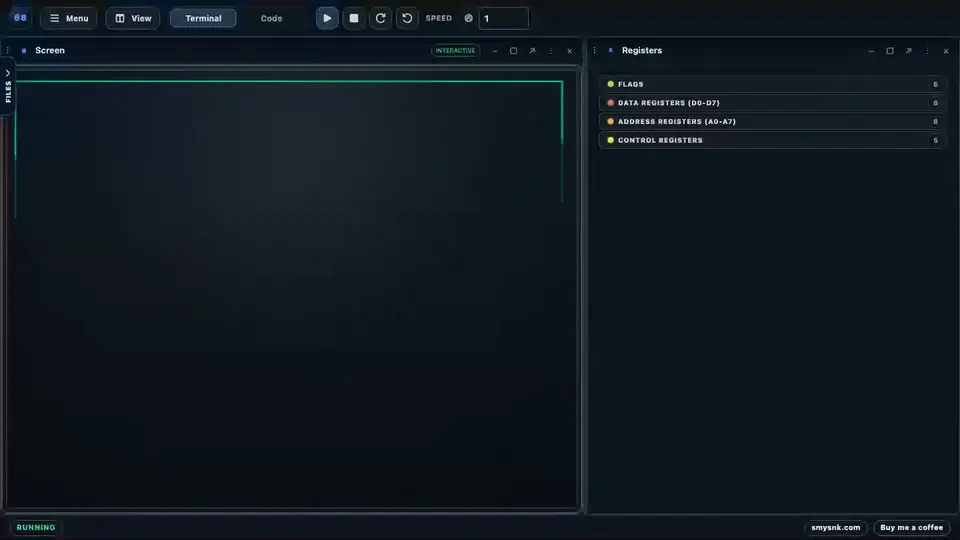

# M68K Interpreter [](https://github.com/smysnk/m68k-interpreter/actions/workflows/ci-cd.yml) [](https://github.com/smysnk/m68k-interpreter/actions/workflows/ci-cd.yml) [](https://smysnk.com/m68k-interpreter)

**Hosted Demo:** [**smysnk.com/m68k-interpreter**](https://smysnk.com/m68k-interpreter)

**Reference:** [M68K instructions and Easy68K compatibility](https://smysnk.com/m68k-interpreter/help) · [Play Nibbles 68000](https://smysnk.com/nibbles)

[](https://github.com/user-attachments/assets/ec1eefff-b997-4261-bd53-46690e0b6075)

A Motorola 68000 assembly emulator that runs entirely in the browser.  
Write, step through, and debug m68k assembly — no installation needed.

---

## Why this exists

[Easy68K](http://www.easy68k.com/) is the standard tool for learning m68k assembly in university courses. It's Windows-only, requires installation, and hasn't been updated in years. This runs in any browser, on any OS, with zero setup.

---

## Features

- Source/address/label breakpoints, conditional stops, hit counts, logpoints, watches, data breakpoints, call stacks, run-to-cursor, and forward/reverse stepping
- Live register viewer and memory inspector
- Detailed error reporting with line context
- Preloaded examples covering common patterns
- Export register and memory state to file
- Runtime batching and keyboard capture for browser-playable terminal programs
- Independently addressable EASy68K panels for seven-segment displays, aligned switches/LEDs/active-low buttons, and CPU interrupt requests
- Canonical Easy68K graphics and WAV sound services with duplicable Graphics and Sound panels
- Level 1–7 autovector interrupts, SR masking, automatic IRQ scheduling, and `RTE`

## Debugging

Click a Code line number or the dedicated debugger gutter—or press `F9`—to toggle a source
breakpoint. The global toolbar provides Continue (`F5`), Pause (`F6`), Stop (`Shift+F5`), and
Restart. The Code panel header provides Step Over (`F10`), Step Into (`F11`), Step Out
(`Shift+F11`), Step Back (`Alt+F11`), and Run to Cursor (`Ctrl/Cmd+F10`), with secondary actions in
an overflow menu when the panel is narrow. Breakpoints stop before their instruction, and Continue
suppresses that exact boundary once so loops can progress.

Choose the **Debug** layout or add a **Debugger** panel explicitly to manage conditions, watches,
write data breakpoints, the logical call stack, and structured stop details. Running, stepping, or
hitting a breakpoint never opens, focuses, or reorders panels. Breakpoints and watches persist,
while source edits leave unresolved locations visibly unbound until the next successful assembly.

Step Back restores the bounded logical machine history (CPU, RAM, devices, diagnostics, graphics,
and sound state). Physical output already emitted by the browser—most notably audio already
heard—cannot be retracted. The bundled `debugger-loop.asm` example is a compact guided exercise.

## Compatibility and instruction coverage

| Profile         | Opcodes/forms | Terminal | Graphics | Sound | Trainer I/O |
| --------------- | ------------: | :------: | :------: | :---: | :---------: |
| MC68000 CPU     |           116 |    —     |    —     |   —   |      —      |
| MC68010 CPU     |           123 |    —     |    —     |   —   |      —      |
| MC68020 CPU     |           163 |    —     |    —     |   —   |      —      |
| Bare machine    |             — |    —     |    —     |   —   |      —      |
| Easy68K machine |             — |    5     |    17    |   8   |      ✓      |

CPU and machine profiles are selected independently. Easy68K services use the canonical
`TRAP #15` ABI: the task is in `D0.B`, execution resumes at `PC + 2`, and task `9`
terminates a program. See [Easy68K compatibility and limitations](docs/EASY68K_SUBSET_AND_LIMITATIONS.md).

MC68020 support is functional rather than cycle-accurate. It includes the integer architecture,
all 18 effective-address categories, 32-bit sparse addressing, three stack banks, control/cache
state, exception frames, and coprocessor absence behavior. MC68881/MC68882 floating-point
arithmetic and MC68851 MMU semantics remain separate future profiles. See the generated
[MC68020 inventory](docs/generated/MC68020_FUNCTIONAL_INVENTORY.md) and
[execution report](docs/MC68020_FUNCTIONAL_CONFORMANCE_EXECUTION_REPORT.md).

## Runtime shape

- the strict byte-addressed core is the single instruction execution authority
- the public `Emulator` API is a compatibility facade over that core
- browser execution uses the worker-backed strict runtime
- CPU model and machine profile are selected independently from the bottom status bar

## IDE architecture

- The shell follows a view/controller Redux pattern
- Top-level interface components are store-connected and prop-free
- Selectors own derived UI models
- Controller hooks own browser/runtime side effects
- Terminal, memory, and live hardware snapshots stay outside Redux in external surface stores

---

<!--
## Examples

The [`packages/ide/src/fixtures/`](./packages/ide/src/fixtures) folder contains bundled example programs to get started:

| File | What it demonstrates |
|---|---|
| `fibonacci.asm` | Loops, D registers, branching |
| `factorial.asm` | Recursion via JSR/RTS, stack discipline |
| `bubble_sort.asm` | Nested loops, memory addressing, CMPI |
| `stack_ops.asm` | MOVE to/from stack pointer, subroutine conventions |
| `hello_world.asm` | Basic MOVE and output |
| `loop_counter.asm` | DBRA countdown loop |

Each file is commented line by line — useful if you are following a computer architecture course.
---
-->

## Built with

React 19 · Redux Toolkit · TypeScript · Vite · Vitest · Playwright

---

## Run locally

```bash
git clone https://github.com/smysnk/m68k-interpreter.git
cd m68k-interpreter
yarn install
cp .env.example .env
yarn dev
```

```bash
yarn dev:raw         # bypass mono-helper and use your own WEB_* env vars
yarn build           # production build
yarn test            # run tests
yarn type-check      # workspace type-check
```

Boot-time IDE env vars:

- `VITE_IDE_PRELOAD_FILE=hello-world.asm` selects which known file should be loaded on startup. You can use the file id, name, or path, for example `example:hello-world.asm`, `hello-world.asm`, or `fixtures/hello-world.asm`.
- `VITE_IDE_AUTOPLAY=true` runs the loaded program automatically on boot.

---

## For educators

If you teach a course that uses Easy68K, this works as a drop-in browser-based alternative — no student setup required. If you use it in your course and want it listed here, open an issue or send an email.

---

## Acknowledgments

Special thanks to [MarkeyJester's Motorola 68000 Beginner's Tutorial](https://mrjester.hapisan.com/04_MC68/Index.html) — an excellent reference for instruction behavior, cycle times, and assembly fundamentals that informed this implementation.

---

## Contributing

PRs welcome. See [CONTRIBUTING.md](CONTRIBUTING.md).

## License

MIT
